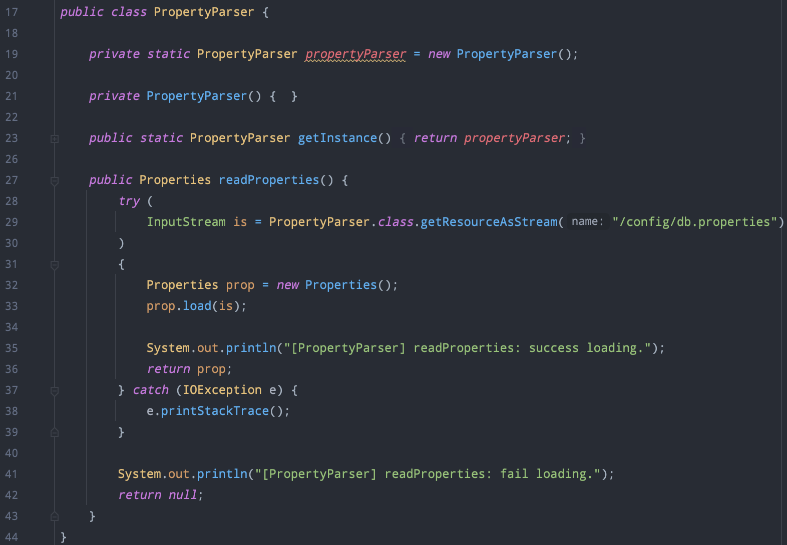
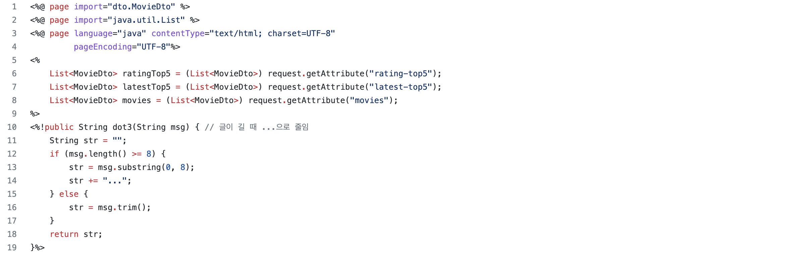

# 영화 예매 사이트 제작 Servlet + JSP

# 목차

- [영화 목록 기능](#영화-목록-기능)

- [화면](#화면)

- [API](#API)

- [트러블슈팅](#트러블슈팅)

  - [팀 공용 데이터베이스 RDS 설정](#팀-공용-데이터베이스-RDS-설정)
  - [영화 목록 데이터 요청 API 리팩토링](#영화-목록-데이터-요청-API-리팩토링)

# 영화 목록 기능

- 모든 영화 목록 조회
- 평점, 최신 TOP5 영화 조회
- 페이징 기능
- 검색 및 필터 기능

# 화면

- 영화 목록 화면
    - `모든 영화` `평점 TOP5` `최신순 TOP5` 영화 목록

- 영화 포스터 하단 `페이지 번호` 로 영화 목록 확인

- 영화 검색 화면
    - `제목` `감독` `배우` 로 영화 검색
    
    
    
  - 영화 목록 조회 필터
      - `평점순` `최신순` 으로 영화 목록 조회

    

# API

# 트러블슈팅

## 팀 공용 데이터베이스 RDS 설정

### RDS를 사용한 이유

로컬 데이터베이스를 사용할 경우 테스트하는 데이터가 제각각이된다. 뿐만 아니라, 각자 다른 데이터를 가지고 있기 때문에 화면에 출력되는 내용이 동기화가 안된다.

이러한 문제를 해결하고자 공용DB를 두어 충분한 데이터를 넣어놓고 팀원들과 사용하기로 했다.

데이터베이스 서버로 RDS를 선정했다. EC로 할 경우 원격으로 접속해서 MySQL을 설치해줘야 하는 번거로움이 있어 RDS로 데이터 서버를 생성했다.

### 프로젝트에 적용

기존 로컬DB에 연결하기 위해 작성해던 부분을 수정했다.

소스코드가 원격 퍼블릭 저장소로 업로드되기 때문에, 민감한 정보를 노출시키지 않기 위해 DB연결 관련 속성 파일을 따로 두어 관리했다.

`src/util/PropertyParser`

`src/db/DBConnection`

`WebContent/WEB-INF/classes/config/db.properties`

`.gitignore`

### 로컬 데이터베이스를 사용하고 싶은 경우

`WebContent/WEB-INF/classes/config/db.properties` 에 기술된 데이터베이스 연결 속성 정보를 로컬 DB에 맞게 맞춰주면 된다.

## 영화 목록 데이터 요청 API 리팩토링

## 고민한 이유

초기에는 영화 페이지가 로딩될 때 JSP를 사용해 `영화 목록 카테고리` 에 있는 모든 데이터를 한 번에 받아왔다.

- `movieList.jsp` 페이지 요청 시 함께 넘어오는 데이터 목록
    - 모든 영화 리스트
    - 평점 TOP5 영화 리스트
    - 최신 TOP5 영화 리스트

영화 목록 상단에 `영화 목록 카테고리` 을 통해 3가지 데이터 목록을 바꿔가며 출력했다. 

*하지만 지금 당장 사용하지 않는 데이터를 모두 불러와 클라이언트 단에서 가지고 있도록 하는게 맞는가?* 라는 의문이 들었다. 그렇다면 모든 영화 목록, 평점 TOP5, 최신 TOP5 를 필요할 때 각각 불러오도록 처리해야겠다는 생각을 했다.

구현 방법이 2가지 있었다. 일단 모든 영화 목록, 평점 TOP5, 최신 TOP5 영화 리스트를 조회하는 URL을 따로 둬야했다.

- 구현 방법 2가지
    - (방법1) 영화 목록 페이지를 넘길 때, 다른 데이터를 DTO에 담아서 넘기고 JSP를 통해 서버에서 페이지를 만든 후 응답해준다.
    - (방법2) 초기에 페이지는 한 번만 응답받고, 이후에는 필요한 데이터만 받아서 영화 목록 내용을 동적으로 변경한다.

화면 전체를 변경하는게 아니라 일부분만 변경해야 하므로, 페이지 전체를 계속 리턴하는 것은 아이러니(?)한 일이라 생각했다. 뿐만 아니라, (방법1)을 적용할 경우 서버에서의 부담이 많아질 것으로 예상되어 (방법2)를 적용해 리팩터링 하기로 구현했다.

## 결과

결과적으로 영화 목록을 화면에 출력하는 성능은 나빠졌다. 클라이언트에서 뷰가 만들어지기 때문에 사용자의 입장에서 영화 목록이 띄워지고 바뀌는 모습이 부자연스러워 보인다. 

이 프로젝트의 경우 영화 데이터가 실시간으로 바뀌지 않고, 영화 목록 화면에서 보여주는 내용도 제한적이기 때문에 SSR 방식을 계속 사용하는게 좋았겠다는 생각이 들었다. 

영화 목록이라는 한 페이지일 뿐인데, 영화 목록 카테고리 탭으로 목록을 바꿔 보기 때문에 페이지가 다르고 내용이 많다고 착각해 이런 생각을 했던 것 같다.

## 리팩토링 코드

**수정 전**

- `MovieController`
    - 쿼리 파라미터로 데이터를 구분했다.
    - 기존에는 영화 목록 모든 데이터를 `request` 에 담아서 페이지와 함께 리턴했다.

    

- `movieList.jsp`
     - 서버 단에서 페이지 렌더링 시 request에 담긴 속성 값들을 꺼내 모든 영화 리스트들을 변수로 저장해두고 사용했다.

     

     

     

**수정 후**

- `MovieHomeController`
    - `movieList.jsp` 페이지로 포워딩
    - 페이지로 포워딩하는 API와 데이터를 보내는 API를 분리하고, 데이터만을 전송하는 Controller 를 추가했다.

    
    
- `MovieController`
    - 모든 영화 목록, 평점 TOP5, 최신 TOP5 데이터 전송

    

    
     
- `movie.js`
    - Ajax를 사용해 비동기 방식으로 데이터 요청을 보내고 응답을 바탕으로 동적으로 페이지에 영화 목록을 출력했다.

    
    
    
